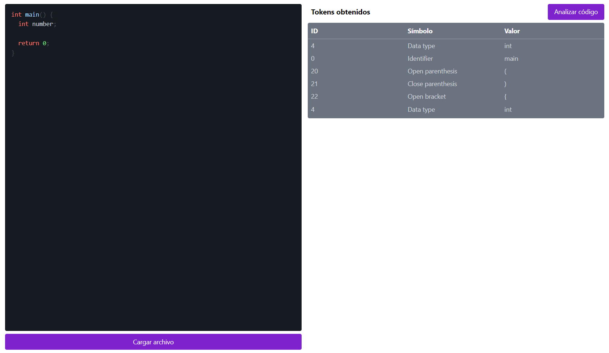
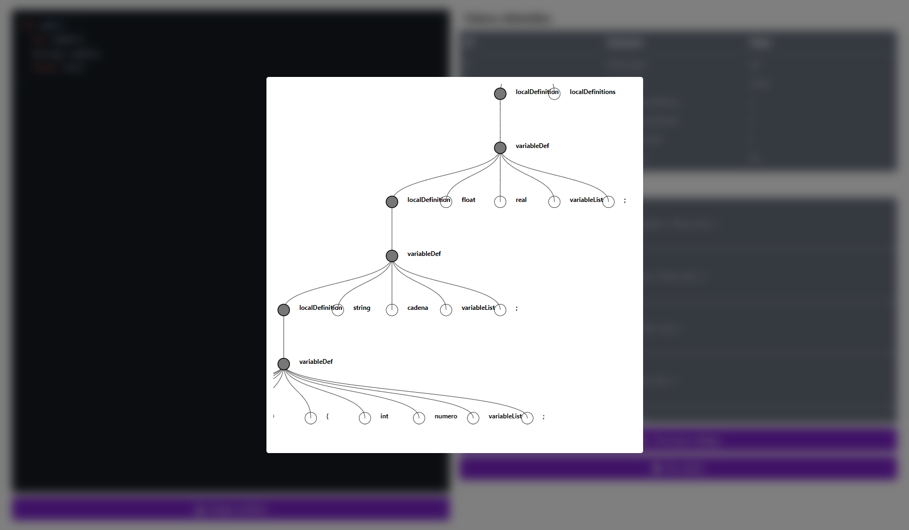
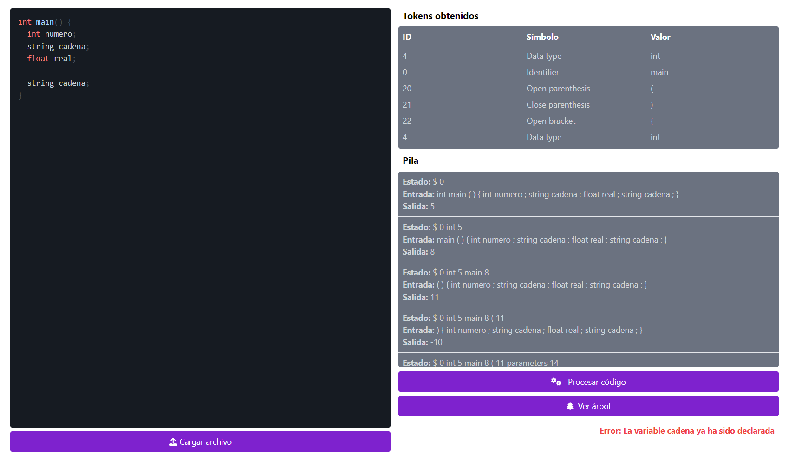

# Seminario de solución de problemas de traductores de lenguaje II

**Alumno:** Hernández Suárez Cesar Alejandro

**Profesor:** López Franco Michel Emanuel

## Proyecto final - Compilador

### Herramientas usadas

Para la creación de este compilador, se usó la librería de *React.js* implementando las herramientas de *Vite*.

Aparte de se usó *Node.js*, las cuales nos permiten el desarrollo de esta aplicación y la exportación en una aplicación web funcional.

Finalmente se usó *TypeScript* y varias librerías disponibles, esto con el propósito de aprender nuevas tecnologías y estas como pueden influir al momento del desarrollo de una aplicación.

### Fases de un compilador

- Analizador léxico

Esta fase se encarga de tomar el código de entrada, leer caracter por caracter y formar componentes a los que llamaremos *tokens*. Estos tokens son especialmente importante definirlos ya que se usarán para la siguiente fase, el analizador sintáctico.

- Analizador sintáctico

El analizador sintáctico es una herramienta que se utiliza para anlizar la estructura gramatical de las palabras dentro de un texto. Este proceso implica descomponer la cadena de palabras en unidades gramaticales y determinar cómo se relacionan entre sí según las reglas definidas del lenguaje.

- Analizador semántico

El analizador semántico se encarga de verificar la semántica de la cadena de entrada, esto se define como la verificación de las variables y si estas han sido declaradas previamente, la comprobación de tipos en las expresiones, la comprobación de los parámetso de una función y la elección de la función u operador en caso de sobrecarga o polimorfismo.

- Compilación de código

Finalmente esta fase toma el código previamente analizado y lo convierte a código máquina, un código que la máquina objetivo puede leer y puede ejecutar las instrucciones que se definieron al momento de escribir el programa.

### Capturas

Captura de la aplicación después de analizar el código introducido

Visualización del árbol generado por el analizador sintáctico

En caso que las variables se llegen a duplicar, el analizador semántico lo reportará como error

