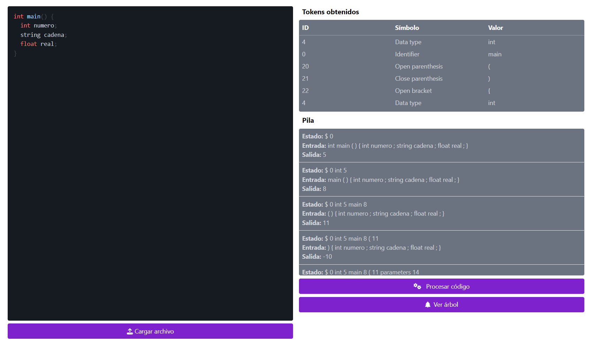

# Seminario de Traductores de Lenguajes II

**Alumno:** Hernández Suárez Cesar Alejandro

**Profesor:** López Franco Michel Emanuel

## Avance: analizador sintáctico

### Objetivo

Implementar un analizador sintáctico. Este analizador se encarga de analizar el código y verificar si la estructura o la sintaxis se respeta, en dado caso que no fuese así, se muestra un error.

### Trabajo realizado

En esta fase encontramos 3 secciones, el editor de código, los tokens obtenidos y la pila.

El editor de texto contiene código de colores, eso quiere decir que le dará el formato y color correcto al momento de ingresar el código. Al final de este también se encuentra un botón con el cual se puede cargar un archivo de texto directamente al editor.

A la derecha está la lista de tokens obtenidos y la pila, los cuales nos muestran el proceso que está ejecutando el analizador léxico y sintáctico.
